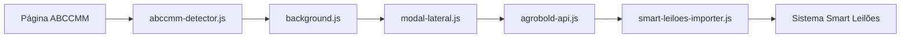

# 🐎 Importador ABCCMM → AgroBold Smart Leilões

Uma extensão Chrome que automatiza a importação de dados de animais do site da ABCCMM (Associação Brasileira dos Criadores de Cavalos Mangalarga Marchador) para o sistema Smart Leilões da AgroBold.


## 🚀 Funcionalidades

### ✨ Detecção Automática
- **Detecção inteligente** de dados de animais em páginas da ABCCMM
- **Modal lateral não-intrusivo** que aparece automaticamente
- **Persistência de dados** entre navegação de páginas

### 📊 Dados Suportados
- **Informações básicas**: Nome, Registro, Sexo, Nascimento, Pelagem
- **Propriedade**: Criador, Proprietário, Livro, Chip
- **Genealogia completa**: Pai, Mãe e linhagens até bisavós
- **Status**: Exame, Vivo, Bloqueado

### 🔐 Sistema de Login
- **Autenticação segura** com API AgroBold
- **Sessão persistente** com tokens de acesso
- **Interface intuitiva** de login no modal lateral

### 🎯 Importação Inteligente
- **Preenchimento automático** de formulários
- **Proteção contra fechamento** acidental durante importação
- **Fallback para preenchimento manual** se API falhar
- **Notificações de sucesso/erro** com SweetAlert

## 📋 Pré-requisitos

- Google Chrome 88+ (Manifest V3)
- Acesso ao sistema Smart Leilões da AgroBold
- Credenciais válidas da AgroBold

## 🛠️ Instalação

### Para Desenvolvimento

1. **Clone o repositório**
   ```bash
   git clone https://github.com/seu-usuario/importador-abccmm-agrobold-smart-leiloes.git
   cd importador-abccmm-agrobold-smart-leiloes
   ```

2. **Abra o Chrome e vá para Extensions**
   ```
   chrome://extensions/
   ```

3. **Ative o "Modo do desenvolvedor"**

4. **Clique em "Carregar sem compactação"** e selecione a pasta do projeto

### Para Produção

1. Baixe a extensão da Chrome Web Store (em breve)
2. Clique em "Adicionar ao Chrome"

## 🎮 Como Usar

### 1️⃣ Primeiro Acesso
1. Clique no ícone da extensão na barra do Chrome
2. Faça login com suas credenciais da AgroBold
3. A extensão ficará ativa automaticamente

### 2️⃣ Importação Automática
1. Navegue para qualquer página de animal na ABCCMM
2. O modal lateral aparecerá automaticamente detectando os dados
3. Clique em **"Importar Dados Detectados"**
4. Aguarde a confirmação de sucesso

### 3️⃣ Gestão do Modal
- **Minimize/Maximize**: Use o botão `-/+` no cabeçalho
- **Arraste**: Clique e arraste pelo cabeçalho para mover
- **Posição persistente**: A posição é salva automaticamente

## 🏗️ Arquitetura

### 📁 Estrutura de Arquivos

```
📦 importador-abccmm-agrobold-smart-leiloes/
├── 📄 manifest.json                    # Configuração da extensão
├── 📄 background.js                    # Service Worker (Manifest V3)
├── 📄 popup.html                       # Interface do popup
├── 📄 popup.js                         # Lógica do popup
├── 📄 styles.css                       # Estilos do popup
├── 📁 scripts/
│   ├── 📄 abccmm-detector.js          # Detecção de dados na ABCCMM
│   ├── 📄 modal-lateral.js            # Interface do modal lateral
│   ├── 📄 smart-leiloes-importer.js   # Importação para Smart Leilões
│   ├── 📄 agrobold-api.js             # Cliente da API AgroBold
│   └── 📄 sweetalert.js               # Notificações
├── 📁 icons/                          # Ícones da extensão
└── 📁 docs/                           # Documentação adicional
```

### 🔄 Fluxo de Dados



### 🧩 Componentes Principais

#### **Background Script** ([`background.js`](background.js))
- Service Worker que gerencia comunicações
- Implementa [`axiosLike`](background.js#L10) para requisições HTTP
- Gerencia autenticação e tokens de acesso

#### **ABCCMM Detector** ([`scripts/abccmm-detector.js`](scripts/abccmm-detector.js))
- Monitora páginas da ABCCMM
- Extrai dados de animais automaticamente
- Funciona com [`extrairDadosAnimal`](scripts/abccmm-detector.js#L124)

#### **Modal Lateral** ([`scripts/modal-lateral.js`](scripts/modal-lateral.js))
- Interface não-intrusiva com [`criarModalLateral`](scripts/modal-lateral.js#L177)
- Sistema de arrastar e minimizar
- Integração com sistema de login

#### **Smart Leilões Importer** ([`scripts/smart-leiloes-importer.js`](scripts/smart-leiloes-importer.js))
- Preenche formulários automaticamente
- Proteção contra fechamento com [`protegerModal`](scripts/smart-leiloes-importer.js#L122)
- Fallback para preenchimento manual

## 🔧 Configuração da API

### Endpoints Utilizados

```javascript
const API_BASE_URL = 'https://sistema.agrobold.com.br/api_importador/importador_abccmm';

// Login
GET /login.php?email=${email}&senha=${senha}

// Importação
POST /importar_dados.php
Authorization: Bearer ${token}
```

### Exemplo de Requisição

```javascript
// Login
const loginConfig = {
  method: 'GET',
  url: `${API_BASE_URL}/login.php?email=user@example.com&senha=password123`,
  headers: {
    'Accept': 'application/json',
    'User-Agent': 'AgroBold-Extension/1.0'
  }
};

// Importação
const importConfig = {
  method: 'POST',
  url: `${API_BASE_URL}/importar_dados.php`,
  headers: {
    'Content-Type': 'application/json',
    'Authorization': `Bearer ${token}`
  },
  data: {
    Nome: 'Cavalo Exemplo',
    Registro: 'ABC123',
    // ... outros dados
  }
};
```

## 🛡️ Segurança

### 🔐 Permissões Mínimas
```json
{
  "permissions": [
    "storage",
    "activeTab",
    "notifications"
  ],
  "host_permissions": [
    "https://abccmm.org.br/*",
    "https://sistema.smartleiloes.digital/*",
    "https://sistema.agrobold.com.br/*"
  ]
}
```

### 🛠️ Boas Práticas Implementadas
- **Content Security Policy** rigorosa
- **Tokens com expiração** automática
- **Validação de dados** antes da importação
- **HTTPS obrigatório** para todas as comunicações

## 🧪 Desenvolvimento

### 🚀 Scripts de Build

```bash
# Instalar dependências (se houver)
npm install

# Executar em modo desenvolvimento
npm run dev

# Build para produção
npm run build

# Executar testes
npm test
```

### 🐛 Debug

1. **Abra as Developer Tools** na página da extensão
2. **Verifique o Console** para logs detalhados
3. **Use o Storage Viewer** para inspecionar dados salvos:
   ```javascript
   // No console da extensão
   chrome.storage.local.get(null, console.log);
   ```

### 📊 Logs Disponíveis

```javascript
// Detecção de dados
console.log("Dados detectados:", dadosAnimal);

// Importação
console.log("Importando dados:", dados);

// Autenticação
console.log("Login realizado:", response);
```

## 🤝 Contribuição

1. **Fork** o projeto
2. **Crie** uma branch para sua feature (`git checkout -b feature/AmazingFeature`)
3. **Commit** suas mudanças (`git commit -m 'Add some AmazingFeature'`)
4. **Push** para a branch (`git push origin feature/AmazingFeature`)
5. **Abra** um Pull Request

### 📋 Guidelines de Código

- Use **ES6+** sempre que possível
- Mantenha **compatibilidade** com Manifest V3
- **Documente** funções complexas
- **Teste** em diferentes versões do Chrome

## 📞 Suporte

### 🐛 Reportar Bugs

Encontrou um problema? [Abra uma issue](https://github.com/seu-usuario/importador-abccmm-agrobold-smart-leiloes/issues) com:

- **Versão** do Chrome
- **Passos** para reproduzir
- **Screenshots** (se aplicável)
- **Logs** do console


## 📄 Licença

Este projeto está licenciado sob a Licença MIT - veja o arquivo [LICENSE](LICENSE) para detalhes.

## 🙏 Agradecimentos

- **ABCCMM** pela disponibilização dos dados públicos
- **AgroBold** pelo suporte técnico e infraestrutura
- **Comunidade Chrome Extensions** pelas melhores práticas

---